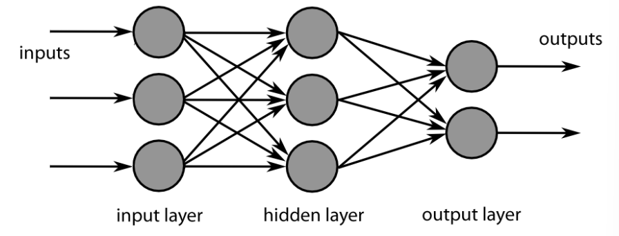
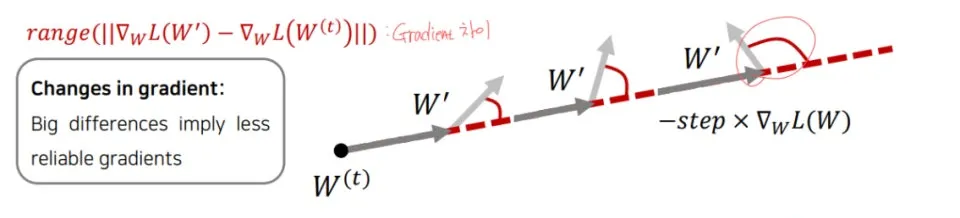
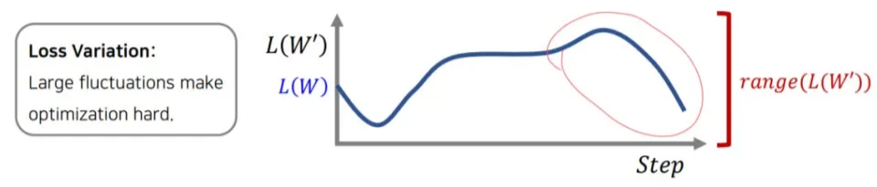

# 3주차 — Layer

### 🎤 발표 핵심

- Layer = 변환 함수
- 왜 여러 층이 필요한가
- Feature hierarchy 개념
- Activation의 역할

### 🔑 키워드

`Layer`, `Feature`, `Activation`, `Depth`

### 🧪 실습

- 1-layer vs Multi-layer NN 비교
- 활성함수 가 Layer 와 상호작용 하는 방식
- Layer 가 많으면 좋은 것인가?

# Layer

- 사전적 의미로 “층”을 의미함
- 단계를 의미하는 층 = 겹겹이 쌓은 양파(여러겹으로 둘러싸여 있음) = 데이터를 변환하는 과정을 여러 번 거친다
- 복잡한 데이터를 정답에 가까운 형태로 단계별로 변환해주는 함수들의 묶음

# Multi-Layer

- 데이터가 정답으로 가기 위해 순서대로 거쳐야 하는 단계
- 원은 노드, 검은 선 하나하나는 가중치(W)
**노드** : 정보를 처리하는 점
**가중치** : 입력값의 중요도를 나타내는 숫자
- 입력값(x)이 선을 지날 때마다 곱하기(입력값 x 가중치)가 일어남
- 단순히 값을 전달하는게 아닌, 데이터를 재가공한다는 점이 중요
- hidden layer(은닉층)에서 변환함수 작동

hidden(은닉)인 이유: 사용자가 입력(X)과 결과(Y)는 눈으로 볼 수 있지만, 이 중간에서 숫자가 어떻게 바뀌고 있는지는 겉에서 보이지 않음

**변환함수**: 데이터를 기계가 이해하기 쉬운 다른 형태로 바꿔주는 필터

# 1-Layer

- 은닉층 없이 입력된 데이터가 바로 가중치와 계산되어 결과로 나옴
- 한계
    - 데이터를 직선 하나로 나누는 것(선형 분리)만 가능
    - 단순한 문제는 빠르고 쉽게 풀지만, 복잡한 데이터의 패턴은 학습할 수 없음

## 활성화 함수가 필요한 이유

- 선형변환의 중복은 선형변환이 된다.
- 비선형성을 부여하기 위해 활성화 함수가 필요!

- X(입력)에서 Y(출력)까지 가는 길에 W0, W1, W2라는 3개의 가중치 층이 있다.(3층 layer)
- B0, B1, B2는 각각 은닉층의 동그라미(노드) 개수
    - **도착하는 층의 동그라미 개수**가 곧 **계산 결과의 개수**이므로, 짝을 맞춰서 더해주기 위해 편향의 개수도 그와 똑같아야 한다.

- 이 변환을 쭉 계산해보면 다음처럼 *Y*=*AX*+*B* 꼴이 나오고, 이는 결국 1층짜리 layer를 가진 신경망과 같아진다.

[https://velog.io/@tri2601/활성화-함수-Activation-function](https://velog.io/@tri2601/%ED%99%9C%EC%84%B1%ED%99%94-%ED%95%A8%EC%88%98-Activation-function)

## 활성화 함수와 레이어 상호작용

레이어(Layer)- 입력된 데이터에 가중치를 곱하고 더해 “총점”을 계산함 = 계산기 역할

→ 활성화 함수(Activation Function)- 레이어가 넘겨준 값을 기준에 따라 변환함 = 필터 역할

→ 다음 레이어로 전달

만약 활성화 함수를 빼고 레이어→레이어만 계속 연결하면
아무리 많이 층을 쌓아도 수학적으로 단 하나의 층(1-Layer)와 같다

### ReLu(렐루)

- 딥러닝에서 가장 널리 사용되는 활성화 함수

- 입력이 0보다 크면 그대로 출력하고, 0 이하이면 0을 출력
    
    → 출력 값의 범위가 0에서 1 사이라 기울기 소실 문제가 발생하는 시그모이드 함수의 문제점 해결
    
- 장점:
    - 계산 효율성: 단순한 max 연산이라 계산 속도가 빠름
    
    
    
    - 기울기 소실 문제 완화: 양수 영역에서 미분값이 무조건 1이라 아무리 곱해도 값이 1임, 기울기 소실 문제가 줄어들음
    - 비선형성: 입력 값이 음수일 때 0을 출력하므로 비선형 함수
        
        선형이란? 곧게 뻗은 직선인데 렐루는 0에서 꺾인 형태라 직선이 아님
        
- 한계:
    - 죽은(ReLU Dying) 문제: 입력값이 음수면 무조건 0을 출력해서 기울기도 무조건 0이 됨
    한번 음수 쪽으로 잘못 빠져서 "죽어버린" 뉴런은 학습이 끝날 때까지 0만 출력하며 아무런 일도 하지 않게 된다.
    - 출력값의 비대칭성 : 
    모든 뉴런의 출력값이 양수(+)면, 다음 층으로 넘어가는 가중치들의 미분값 부호가 **모두 같아지게 다.** (전부 증가하거나, 전부 감소하거나)
        - 가중치의 기울기 = (이전 뉴런의 출력) x (뒤에서 전파된 기울기)
        
        가중치 업데이트가 다양한 방향으로 퍼지지 못해서 비효율적
        
    

[https://velog.io/@corial/활성화-함수ReLu](https://velog.io/@corial/%ED%99%9C%EC%84%B1%ED%99%94-%ED%95%A8%EC%88%98ReLu)

[https://www.kim2kie.com/res/html/0_formula/00 AI/ReLU.html](https://www.kim2kie.com/res/html/0_formula/00%20AI/ReLU.html)

- Layer = 자로 선 긋기
- Activation = 선을 구부리는 도구
- 딥러닝 =
    
    **선을 긋고 → 구부리고 → 다시 긋고 → 다시 구부리기**
    

### **1-Layer NN (단층 퍼셉트론) VS Multi-Layer NN (다층 퍼셉트론, 딥러닝)**

**① 1-Layer NN** 
• **작동 원리:** Y = WX + B
• **특징:** 데이터를 가르는 경계선이 무조건 **'직선'** 하나
• **치명적 단점 (XOR 문제)**

**② Multi-Layer NN** 

• **작동 원리:** Y = f(W2*f(W1X + B1) + B2)...
• **특징:**
    1. **은닉층(Hidden Layer):** 은닉층의 각 뉴런이 각각 하나의 직선을 만든다.
    2. **활성화 함수(Activation):** 그은 직선들을 구부리고 합칩니다.(선형 조합 뒤에 비선형성 추가해서 경계가 직선이 아니게 된다.)
• **결과:** 동그라미, S자 곡선, 도넛 모양 등 **원하는 어떤 모양의 경계선**도 만들 수 있습니다.
• **강점:** "특징의 계층화(Feature Hierarchy)"가 가능해져서, 깊어질수록 더 고차원적인 정보)를 이해합니다.

🔹 Multi-Layer와 Feature Hierarchy의 관계

- 은닉층이 **많을수록**
- 특징을 **더 세분화**하고
- **점점 추상적인 정보**를 만들어냄

- 활성화 함수가 있어야 👉 각 층이 **서로 다른 특징 공간**을 학습 가능
    - 활성화 함수가 없으면 모든 층이 선형이기 때문

## Feature Hierarchy (특징의 계층화)

- 신경망의 각 층(layer)이 서로 다른 수준의 특징(feature)을 단계적으로 학습하는 구조
- 쉬운 것부터 어려운 것까지 단계적으로 해석

- 왼쪽 그림:
 데이터가 흘러가는 순서 = 계층이 쌓이는 순서
- 오른쪽 그림:
정보의 양과 깊이(Depth) 시각화
    - **판판한 판 (Input):** 얇은 원본 데이터입니다.
    - **두꺼운 블록 (Hidden):** 층을 지날수록 Depth(깊이)가 생긴다.
        - 이것은 단순히 층의 개수가 아니라, 추출한 특징(Feature)의 개수가 많아지고 정보가 풍성해짐을 의미한다.
    - **작은 블록 (Output):** 마지막에는 모든 풍성한 정보를 압축하여 하나의 정답(결과)으로 요약한다.

Depth(깊이):  쌓아 올린 층(Layer)의 개수 / Layer의 깊이

- 깊어질수록  특징이 단계적으로 추상화
- 위 그림에서 블록의 두께, 해당 층에서 찾아낸 특징이 얼마나 많은지 나타냄
- 우리가 "딥러닝(Deep Learning)"이라고 부를 때의 'Deep'이 바로 이 의미
- 입력층과 출력층 사이에 은닉층(Hidden Layer)이 많이 쌓여있을수록 “모델의 깊이(Depth)가 깊다”고 표현

## Layer가 많으면 무조건 좋은 것인가?

→ 아니다.

### **과적합 (Overfitting):**

층이 너무 깊어서 쓸데없는 패턴(노이즈)까지 외워버리는 문제

발생:

- 모델이 깊어 파라미터 수가 많고, 표현력이 좋은 모델
층이 깊어질수록:
    - 노드 수 ↑
    - 연결선(가중치) ↑
    - 편향 개수 ↑

👉 조정해야 할 숫자가 **기하급수적으로 늘어남**

- 학습용 데이터셋의 양이 부족한 경우
    - **학습용 데이터가 적으면, 모델은 ‘일반적인 규칙’이 아니라 ‘개별 사례’를 외우게 된다.**
    
    → 그래서 과적합이 발생함.
    
    ### Dropout; 과적합 해결책
    
    
    
    드롭아웃은 과적합을 막아주어 
    모델이 **정답을 더 잘 맞히게(성능 향상)** 만든다.
    
    Epoch(에폭): 반복 학습 횟수(문제집 회독 수)
    
    Accuracy(애큐러시): 정확도(시험 점수)
    
    Model Accuracy: 모델 정확도(모델의 성적표)
    
    아래 그래프는 공부를 많이 할수록 성적이 어떻게 변하는가?를 보여줌
    
    
    
- **현상:** `Training Accuracy`(파란선, 학습 점수)는 계속 올라가는데, `Test Accuracy`(주황선, 실전 점수)는 어느 순간 증가하지 않고 멈춥니다.
→ 학습 데이터는 거의 완벽하게 맞추지만, 새로운 데이터(Test)는 잘 맞추지 못함
- **의미:** **과적합(Overfitting)** 발생. 기계가 문제집 답만 달달 외워서 실전 문제는 못 푸는 상태입니다.

- **현상:** `Training`과 `Test` 점수가 **비슷하게 같이 내려갑니다.** (오차가 줄어듦)
- **의미:** **일반화(Generalization)** 성공. Dropout(답을 외우지 못하게 방해)과 같은 정규화 기법을 적용했을 경우 나타날 수 있는 전형적인 패턴이다.

Dropout은 학습 중에:

- 일부 뉴런을 **무작위로 꺼버림**
- → 특정 뉴런에 **과도하게 의존 못 함**
- → **암기 방지**
- → Test 성능 ↑

### 드롭아웃을 썼을 때 기대되는 전형적인 결과

### 📌 Accuracy 기준

- 드롭아웃 적용 시, 매 학습마다 사용되는 뉴런이 달라짐
- → 모델이 **훈련 데이터를 완벽히 외우기 어려워짐**
- → Train accuracy가 100%에 과도하게 수렴하지 않음
- → 대신 Test accuracy가 **안정적으로 증가**

### 📌 Loss 기준

- 드롭아웃은 모델 복잡도를 줄이는 정규화 기법
- → Train / Test loss 차이를 줄임
- → 과적합 시 나타나는 Test loss 급상승이 억제됨

### 주의점

 **과도한 비활성화 방지**: 
너무 많은 뉴런을 드롭아웃 시키면 모델이 학습에 필요한 정보까지 잃어버려

👉**학습 자체가 불안정해지거나 성능이 오히려 떨어질 수 있다.**

- 일반적으로 **20~50% (0.2 ~ 0.5)** 정도의 드롭아웃 비율이 권장됨
- 입력층: 보통 낮게 (0.1~0.2)
- 은닉층: 0.3~0.5가 많이 사용됨

[https://blog.naver.com/shr8596/222699815060](https://blog.naver.com/shr8596/222699815060)
 [https://blog.naver.com/guide7693/223877055895](https://blog.naver.com/guide7693/223877055895)

[https://velog.io/@nochesita/딥러닝-Dropout-A-Simple-Way-to-Prevent-Neural-Networks-fromOverfitting](https://velog.io/@nochesita/%EB%94%A5%EB%9F%AC%EB%8B%9D-Dropout-A-Simple-Way-to-Prevent-Neural-Networks-fromOverfitting)

### **기울기 소실 (Vanishing Gradient):**

층이 너무 깊어서 역전파 시 오차 신호가 입력층까지 전달되지 않고 사라지는 문제

역전파에서 가중치 업데이트는 미분값들을 계속 곱하는 구조인데 *미분값이 대부분 1보다 작다*는 문제가 발생

1보다 작은 수를 계속 곱하면 값이 급격히 0에 가까워진다.

- 아무리 빼도 변화가 없음
- 가중치가 사실상 업데이트되지 않음

👉 **학습이 멈춘 것처럼 보임**

- 출력층 근처: 곱셈 횟수 적음 → 아직 기울기 있음
- 입력층 근처: 곱셈 횟수 많음 → 기울기 거의 0

👉 **초기 layer가 학습되지 않는다.**

### 배치 정규화(Batch Normallization); 기울기 소실 해결책

- 앞 단계에서 숫자를 제멋대로 줘도, 중간에서 '적절한 크기'로 예쁘게 다듬어서 넘겨주기 때문에 뒤 단계가 당황하지 않고 안정적으로 배우는 것
- 일반적으로 Batch Normalization은 **선형 변환(WX+B) 이후, 활성화 함수 이전**
    
    에 적용된다.
    
    
    
    배치 정규화는 ‘값의 분포’를 정리하는 역할이고, 활성화 함수는 그 정리된 값을 ‘비선형’으로 변형하는 역할이기 때문
    
- 층마다 데이터 분포가 널뛰는 현상(내부 공변량 변화)을 막기 위해 도입

- 기울기(방향)가 너무 자주, 크게 변해서 기계가 어디로 가야할지 몰라 헤매게 된다.

- 아래 그림: L(W)가 부드럽게 내려가는게 아니라 위아래로 심하게 출렁거려, 조금만 움직여도 점수(Loss)가 확 나빠졌다가 확 좋아진다. → 속도를 낼 수가 없

- 평균을 0에 가깝게 (데이터가 양수/음수 섞여야 ****지그재그 없이 최단 거리로 학습하니까) & 분산을 1에 가깝게 유지(숫자가 너무 커지면(양 끝) 기울기가 죽으니, 기울기가 산 0 근처(가운데)로 모으기 위해.) → 값이 지나치게 커지거나 작아지는 것을 방지

### 시그모이드 함수

- 역할:  출력값이 0과 1 사이에 갇혀있어서 어떤 숫자가 들어오든 확률(0% ~ 100%)처럼 바꿔줍니다
- 모양: 가운데는 미분값이 커서 학습이 잘되고 양 끝은 미분값이 거의 0이라 학습이 멈춘다는 것을 나타냅니다

- **배치 정규화의 목표:**
    - 데이터를 저 그래프의 가운데(경사가 급한 곳, 0 근처)로 강제로 몰아넣는 것입니다.
- **이유:**
    - 데이터가 양 끝(평평한 곳)으로 가버리면 기울기가 0이 되어 죽어버리니까, *기울기가 살아있는 가운데 구역(Safe Zone)*에서만 놀게 하려는 것입니다.

장점:

- **학습 속도 향상**: 배치정규화를 통해 길을 평평하게 닦아 놓았으니 빠르게 목표지점 도달 가능
- **초기값에 덜 민감**:  시작을 대충 잡아서 숫자가 좀 이상하게 커져도, 중간에 배치 정규화가 **"**강제로 다시 0과 1 사이로 예쁘게 맞춰줌”
- **과적합 완화(regularization)**: 약간의 불확실성(노이즈)이 섞이니까, 기계가 데이터 하나하나에 너무 집착하지 않게 되어(Dropout 효과) 오히려 맷집이 세

→ 연습 문제(Training Data)만 잘 푸는 게 아니라, 처음 보는 실전 문제(Test Data)를 만났을 때도 당황하지 않고 정답을 잘 맞히게 됩니다.

<aside>
💡

Dropout은 의존성 차단(암기 방지)에 초점이 있고, Batch Normalization은 분포 안정화(학습 안정)에 초점이 있다.

</aside>