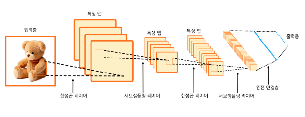
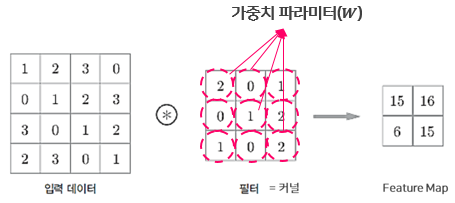
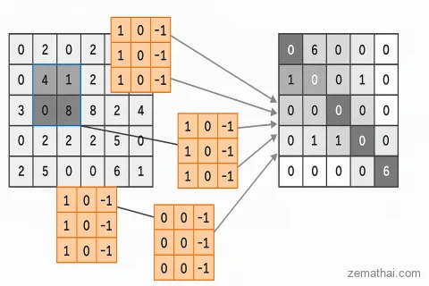

# 4주차 — CNN

### 🔑 키워드

- Convolution / Kernel
- Receptive field
- Pooling
- Feature map
- Weight sharing

### 📌 핵심 포인트

- CNN이 왜 파라미터 수를 줄이는가
- “위치 불변성”이란 무엇인가
- Conv = 패턴 탐지기라는 직관
- CNN vs Fully Connected 차이

👉 이미지뿐 아니라 **시계열·텍스트에도 쓰인다는 점**

# CNN(Convolutional Neural Network)

- 합성곱 신경망
- 인간의 시신경 구조를 모방해서 만들어진 신경망
= 사람이 여러 데이터를 보고 기억한 후에 무엇인지 맞추는 것과 유사
= 주로 시각적 이미지 분석에 사용됨
- 이미지, 동영상 등의 그리드(grid) 형태 데이터 처리에서 뛰어남
- 크게 특징 배우기(Feature Learning)/분류하기(Classification) 으로 나뉨

### 기존 인공신경망(특히 다층 퍼셉트론)의 문제점

- 이미지를 구성하는 **픽셀** 하나하나를 독립적인 숫자로 취급
픽셀=디지털 이미지에서 가장 작은 점(단위)
- 많은 숫자를 그냥 길게 늘어놓은 벡터로 입력해서 픽셀의 위치 정보를 모름
- 입력 차원이 매우 커져 연산량이 증가하고 학습 효율이 떨어짐

### CNN은 이 문제를 어떻게 해결했는가?

- 위치 정보를 모른 → 공간 구조 유지
이미지를 한 줄로 펴지 않고 가로 * 세로 * **채널** 형태 그대로 입력 받음
    - 채널=이미지의 두께(Depth)
    - 흑백은 1개 채널, 컬러는 RGB 3채
- 픽셀 하나만 봄 → 커널을 통해 주변 픽셀들을 묶어서 봄
공간적 특징(패턴)을 파악할 수 있음
- 연산량이 너무 많다 → 가중치 공유(하나의 커널을 이미지 전체에 돌려씀)를 통해 파라미터(w) 수를 줄어들게 만들음

### CNN이 주로 사용되는 분야는?

- 컴퓨터가 눈으로 보고 판단하는 기술
    - 이미지 분류
    - 객체 탐지(사진 안에서 “어디에” 물체가 있는지)
    - 얼굴 인식
- 의료 영상 분석-사람의 눈보다 더 미세한 패턴을 찾을 수 있음
    - 질병 진단
- 텍스트/시계열(1D Conv) : 한 줄로 늘어선 연속적인 데이터(1차원) 형태
    - **시계열 센서 데이터**: [0.2, 0.5, 0.7, 0.1, …]
        - 예: 심박 센서, 온도 센서, 주가 데이터
        - 센서가 시간 순서대로 측정한 값들을 숫자로 나열
        - [0.2, 0.5, 0.7, 0.1] = 센서가 t=1,2,3,4 시점에 측정한 값
    - **단어 임베딩(Word Embedding)** → 각 단어를 숫자 벡터로 변환
        - 예: "나는" → w1
        - "오늘" → w2
        - "기분이" → w3 …
    - 그래서 문장은 [w1, w2, w3, …] 형태의 **숫자 벡터 시퀀스**가 됨

## CNN 레이어 구조

### 특징 배우기(Feature Learning)

1. 입력층(Input)
- 원본 사진을 숫자들의 격자(Grid)로 인식함
1. 합성곱 레이어(Convolution Layer)
- 커널로 특징을 찾아내는 단계
- 입력 이미지의 작은 영역이 특징 맵의 한 점으로 변환됨
- 여러개의 필터를 쓰기 때문에 특징 맵이 여러장 만들어짐
1. 서브샘플링 레이어(Subsampling Layer)
- 풀링(Pooling)을 진행 → 위치불변성 = 대상에 어디에 있든 위치와 상관없이 동일한 사물로 인식 = 위치가 약간 변해도 주요 특징이 유지되게 만들어줌

### Pooling

- 정의:
    
    가로, 세로 크기(공간 해상도)를 인위적으로 줄이는 연산
    
- 종류:
    - Max Pooling(최대 풀링): 정해진 영역에서 가장 큰 값 하나만 남김, 가장 중요한 특징 유지
    - Average Pooling(평균 풀링): 정해진 영역의 평균값을 구함, 평균 정보 유
- 목표: 차원 축소=불필요한 정보 버리고 핵심만 남겨 연산량과 파라미터 수를 감소시킴

 

- 이미지 크기를 줄여서 연산량을 낮추고, 중요한 특징만 남김
1. 반복(Convolution → Subsampling)
- 뒤로 갈수록 특징 맵의 크기는 작아지고, 개수는 많아짐
- 처음에는 단순한 선을 찾지만 뒤로 갈수록 복잡하고 다양한 특징을 찾음

---

### 분류(Classification)

1. 완전 연결층(Fully Connected Layer)
- 특징 맵들을 한 줄로 쭉 폄
- 여태 찾은 특징들을 모두 종합한 결론을 내리기 위해 일반 신경망에 연결함
1. 출력층(Output)
- 결과를 출력함

### Convolution(합성곱)

- 정의:  입력 데이터 위에서 필터(커널)을 일정 간격(**Stride**)으로 이동시키며 겹치는 부분의 각 원소끼리 곱하고 더하는 연산
Stride= 기본적으로 1로 설정되며, 필터가 매 연산마다 한 픽셀씩 이동함을 뜻함
- 목적: 이미지의 모양과 위치를 유지하며 이미지의 고유한 특징을 추출하는 것

→ 필터를 이미지 위에서 슬라이딩 시키면서 점수(곱의 합)을 매겨보니까, 필터랑 똑같이 생긴 곳에서는 점수가 엄청 높게 나오고 다르게 생긴 곳에서는 점수가 낮게 나온다

### Kernel(커널)

- 역할: 입력 데이터 위를 슬라이딩하며 특징을 추출하는 가중치(w)들의 집합
         이미지에서 특정 특징을 찾기 위해 사용하는 작은 필터(작은 크기의 행렬)
         입력 데이터와 커널의 겹치는 부분을 곱하고 더해서 하나의 값으로 만들
- 크기: 주로 3*3이나 5*5, 작은 정사각 행렬
- 커널 내부의 숫자는 무작위이나 학습을 통해 최적의 특징을 찾도록 업데이트

### Feature Map(특징 맵)

합성곱 연산(Convolution) 결과로 만들어진 출력

- 의미:  이미지의 특정 패턴이 어느 위치에 존재하는지, 얼마나 강하게 존재하는지 시각화한 지도
- 특징:
    - 값이 클수록 그 특징이 해당 위치에 뚜렷하게 존재함을 의미함
    - 커널이 여러개면 다양한 특징을 동시에 표현 가능
- 시각화:
    - 필터가 감지한 특징이 있는 부분은 높은 값(하얀색/밝은색)으로, 없는 부분은 낮은 값(검은색/어두운색)으로 표현됨
    - 사용된 커널의 개수(Depth)만큼 여러 장의 특징 맵이 생성됨

### Padding(패딩)

이미지의 가장자리에 특정 값으로 설정된 픽셀들을 추가해서 입력 이미지와 출력 이미지의 크기를 비슷하게 만든다.

특정 값을 0으로 둔 픽셀을 추가하는 것을 zero-padding이라고 하며 CNN에서는 주로 이것이 이용된다.

## 합성곱 레이어가 실제로 어떻게 작동하는지 확인

CNN에 Padding(패딩)이 왜 필요한지, 적용 했을 때와 아닐 때 어떤 차이가 있는지

- 라이브러리를 꺼냄
    - torch: 딥러닝 계산을 담당
    - torchvision: 이미지 처리에 필요, 유명한 데이터셋(MNIST 등)이 들어있음
    - transforms: 이미지를 파이토치가 이해할 수 있는 숫자로 바꿔주는 변환기
    - torch.nn: 인공신경망 층들을 만들어줌
    - matplotlib.pyplot: 데이터를 그래프나 그림으로 시각화해서 보여줌

transform = transforms.ToTensor()

- 우리가 보는 이미지는 보통 1~255 사이의 숫자(RGB 값)
- 파이토치 딥러닝 모델은 0.0~1.0 사이의 소수점 숫자를 좋아 
→ ToTensor(): 이미지를 Tensor(텐서)라는 행렬 형태로 바꾸고 숫자 범위를 0~1로 정리해줌
→ 일종의 자동 번역기

mnist = torchvision.datasets.MNIST(root='./data', train=True, download=True, transform=transform)

- **root='./data'**: 데이터를 현재 폴더의 data라는 폴더에 저장하겠다는 뜻
- **train=True**: 학습용 데이터(60,000장)를 가져옵니다. (False면 시험용 10,000장)
- **download=True**: 데이터가 없으면 인터넷에서 다운로드
- **transform=transform**: 데이터를 가져올 때, 아까 만든 **변환기(ToTensor)를 통과시켜서 가져오라**는 뜻. 이제 가져오는 즉시 파이토치용 숫자로 변신한다.

img, label = mnist[0]         # 첫 번째 숫자 이미지 가져오기
img_batch = img.unsqueeze(0)  # 차원 늘리기

- **mnist[0**]:  첫 번째 숫자 이미지 가져오기
    - img: 숫자 ‘5’의 이미지 데이터, 크기는 [1,28,28](채널 1개, 세로 28, 가로 28)
    - label: 정답지, 숫자 5가 들어있음
- img.unsqueeze(0)
    - **문제점**: nn.Conv2d 같은 딥러닝 레이어는 이미지를 한 번에 뭉텅이(Batch)로 처리하도록 설계되어 있고 그래서 항상 4차원 명찰을 확인한다.
        - **필요한 모양**: [배치크기(N), 채널(C), 높이(H), 너비(W)]
        - **현재 모양**: [1(C), 28(H), 28(W)] (배치 크기가 없음!)
    - **해결책**: unsqueeze(0)은 0번째 자리(맨 앞)에 차원을 하나 억지로 끼워 넣는다.
    - **결과**: [1, 1, 28, 28]이 다.
        - 해석: **"1개의 묶음 안에, 1개의 채널을 가진, 28x28 크기의 이미지가 있다"**

class CNN_NoPadding(nn.Module): CNN_NoPadding 이라는 새로운 클래스를 만들고, 파이토치의 모든 신경망 모델은 nn.Module이라는 부모 클래스를 상속받음

def **init**(self):
super(CNN_NoPadding, self).**init**()
self.conv = nn.Conv2d(in_channels=1, out_channels=3, kernel_size=3, padding=0)

- **def __init__(self):**
    - 모델이 처음 생성될 때(태어날 때) 실행되는 함수
    - 여기서 사용할 부품들을 미리 정의함
- **super(...).__init__()**
    - "내 부모님(nn.Module)의 초기화 기능도 잊지 말고 실행해줘"라는 뜻
    - 이걸 안 하면 신경망 기능이 제대로 작동 안 함
- **self.conv = ...**
    - **핵심!** 합성곱(Convolution) 레이어를 하나 만들어서 self.conv라는 이름표를 붙여줌
    - **in_channels=1**: 입력으로 들어오는 그림의 채널 수, 흑백 이미지(MNIST)라서 **1**(컬러 사진이면 3(RGB)을 넣어야 함)
    - **out_channels=3**: 필터 3개를 써서 특징 3가지를 뽑아내겠다는 뜻, 결과물은 3장의 겹쳐진 그림(채널 3)
    - **kernel_size=3**: 필터(돋보기)의 크기가 가로세로 **3x3**이라는 뜻
    - **padding=0**: **(모델 A의 특징)** 테두리에 0을 채워 넣지 **않겠다**는 뜻

def forward(self, x):
return self.conv(x)

- **def forward(self, x):**: 데이터(x)가 들어오면 어떻게 처리해서 내보낼지 길을 알려주는 함수
- **return self.conv(x)**: "들어온 데이터 x를 아까 준비한 self.conv 기계에 통과시킨 뒤, 그 결과를 반환해라"라는 뜻

모델 B: 패딩 있는 버전(CNN_WithPadding)

self.conv = nn.Conv2d(..., padding=1)

- **padding=1**: **(모델 B의 특징)** 이미지 상하좌우에 1픽셀 두께의 테두리(0값)를 두르겠다는 뜻입니다.

모델 A와 모델 B의 차이
왜 결과 크기가 달라질까? 계산해봄 (입력 크기: 28)
**A. 패딩 없음 (padding=0)**
• 공식: 입력 - 필터 + 1
• 계산: 28 - 3 + 1 = 26
• 설명: 3칸짜리 필터가 28칸 위를 움직이면, 양쪽 끝 1칸씩은 필터의 중심이 갈 수 없어서 총 2칸이 줄어듭니다.
**B. 패딩 있음 (padding=1)**
• 실제 입력 변화: 테두리가 양쪽에 1씩 생겨서, 입력이 **30**($28 + 1 + 1$)인 것처럼 행동합니다.
• 계산: 30 - 3 + 1 = 28
• 설명: 이미지를 인위적으로 키워놨기 때문에, 줄어들어도 원래 크기(28)로 돌아옵니다. **즉, 원본 크기 보존(Keep Size)이 됩니다.**

model_no_pad = CNN_NoPadding()
model_with_pad = CNN_WithPadding()

- 앞에서 만든 class를 보고 객체 2개를 만ㄷ르음

 with torch.no_grad()

- **grad (Gradient, 기울기)**: 딥러닝 모델은 원래 학습(공부)을 하기 위해, 자신이 틀린 문제를 미분해서 기록해두는 습관이 있습니다. (메모리를 많이 잡아먹습니다.)
- **no_grad()**: 지금은 학습(공부)하는 거 아니라 그냥 문제만 풀고(테스트), 기록은 하지 마라고 명령하는 것
- **효과:**
1. **메모리 절약:** 쓸데없는 계산 기록을 안 남깁니다.
2. **속도 향상:** 계산이 훨씬 빨라집니다.

out_no_pad = model_no_pad(img_batch)
out_with_pad = model_with_pad(img_batch)

- **img_batch**: 1단계에서 만들어둔 **[1, 1, 28, 28]** 모양의 데이터(숫자 5) 뭉치입니다.
- **작동:** 이 데이터를 두 모델의 입구에 각각 집어넣습니다. 모델 내부의 forward 함수가 실행되면서 합성곱 연산이 일어납니다.
- **결과:** 처리된 결과물(Feature Map)이 out_... 변수에 저장됩니다.

print(f"원본 크기: {img.shape}")
print("-" * 30)
print(f"A 패딩 x 결과: {out_no_pad.shape} (26으로 줄어듦!)")
print(f"B 패딩 o 결과: {out_with_pad.shape} (28로 유지됨!)")

출력된 결과(shape)를 해석해 볼까요?

- **원본:** [1, 28, 28] (가로 세로 28)
- **A (패딩 X) 결과:** [1, 3, 26, 26]
    - 1: 이미지 1장
    - 3: 필터를 3개 썼으니 결과물도 3장 (채널 3)
    - **26, 26**: **패딩이 없어서 귀퉁이가 깎여 나갔습니다!** (28 → 26)
- **B (패딩 O) 결과:** [1, 3, 28, 28]
    - 1: 이미지 1장
    - 3: 결과물 3장
    - **28, 28**: **패딩 덕분에 크기가 원본과 똑같이 유지되었습니다!**

결과물을 눈으로 직접 확인할 수 있도록 시각화 해줌

컴퓨터가 계산한 숫자 덩어리들을 이해하기 쉬운 ‘그림’으로 바꿔줌

plt.figure(figsize=(10, 6))

- **의미:** 그림을 그릴 전체 도화지(Figure)의 크기를 설정합니다.
- **figsize=(10, 6)**: 가로 10인치, 세로 6인치 크기의 도화지를 폅니다.

for i in range(3):
plt.subplot(2, 3, i + 1)

- **for i in range(3)**: 아까 모델 만들 때 out_channels=3으로 설정했었죠? 그래서 결과물 그림이 총 3장(Map 1, 2, 3)입니다. 이걸 하나씩 꺼내기 위해 반복문을 돕니다.
- **plt.subplot(2, 3, i + 1)**: 도화지를 바둑판처럼 나눕니다.
    - **2**: 전체 2줄(행) 중에서
    - **3**: 한 줄에 3칸(열)씩 그리는데
    - **i + 1**: 이번에는 **(i+1)번째 칸**에 그릴 차례다! (1, 2, 3번째 칸)

plt.imshow(out_no_pad[0, i].numpy(), cmap='gray')

1. **out_no_pad[0, i]**: 4차원 데이터 [1, 3, 26, 26]에서 **첫 번째 이미지(0)**의 **i번째 채널**을 쏙 뽑아냅니다. 그러면 2차원 [26, 26] 이미지가 됩니다.
2. **.numpy()**: **(매우 중요)** 파이토치 텐서(Tensor)는 matplotlib이 바로 이해하지 못할 때가 많습니다. 그래서 파이썬의 기본 숫자 행렬인 **NumPy 배열**로 변환해 줍니다.
3. **cmap='gray'**: "이 숫자들을 색깔이 아닌 흑백(Grayscale) 명암으로 표현해라"라고 지정합니다.

plt.title(f"[No Pad] Map {i+1}")
plt.axis('off')

- **plt.title**: 그림 위에 제목을 달아줍니다.
- **plt.axis('off')**: x축, y축의 눈금(숫자)을 없앱니다. 이미지 볼 때 눈금은 필요 없으니까 깔끔하게 지우는 겁니다.

for i in range(3):
plt.subplot(2, 3, i + 4)

- **plt.subplot(2, 3, i + 4)**: 이번에는 아랫줄에 그려야 하니 칸 번호가 **4, 5, 6**번이 됩니다. 그래서 i + 4를 해줍니다.
- 나머지 코드는 윗줄과 동일합니다. 다만 out_with_pad 데이터를 사용합니다.

plt.tight_layout()
plt.show()

- **plt.tight_layout()**: "그림이랑 제목이랑 서로 겹치지 않게 간격을 예쁘게 자동 조절해줘"라는 기능입니다. 이걸 안 쓰면 제목이 윗집 바닥을 뚫고 들어가는 참사가 종종 일어납니다.
- **plt.show()**: "자, 이제 준비 다 됐으니 화면에 띄워!"라는 최종 명령입니다.

 

### Weight Sharing(가중치 공유)

- 정의:  하나의 커널을 이미지 전체를 흝으며 반복 적용하는 방법
- 장점:
    - 동일한 특징을 이미지의 모든 위치에서 탐지 가능 = 위치 불변성
    - 하나로 돌려쓰니까 파라미터 수 크게 줄임→연산량 감소, 학습 효율 향상, 과적합 방지
    
- **공유를 안 한다면?** 이미지 왼쪽 위를 담당하는 커널, 오른쪽 아래를 담당하는 커널... 등등 **수천 개의 커널**을 다 따로따로 학습시켜야 한다. (관리할 숫자가 수만 개)
- **공유를 한다면(CNN)?** 이미지 전체를 돌아다니는 딱 1개의 커널(숫자 9개)만 학습시키면 다.

- 보통 CNN에서는 ReLU(렐루)를 써서 음수는 0을 반환한다
- 같은 0이어도 진할수록 특징이 강력하게 있다함
    - 짙은 회색 0들은 **합성곱 연산에 실제로 참여한 부분(커널 겹친 영역)**
    - 밝은 회색 0들은 **커널이 닿지 않은 부분(연산에서 제외된 영역)**
    
    →위의 사진은 패딩이 없어서 가장자리 쪽 픽셀들은 연산 결과가 안나
    

### Receptive Field(수용 영역)

- 의미: 출력 레이어의 한 뉴런(한 픽셀)이 원본 입력 이미지에서 얼마만큼의 영역을 보고 있는지를 나타내는 크기
- 레이어가 깊어질수록 단순한 특징들을 조합해 복잡한 특징을 추출할 수 있음

- **`def __init__(self):`**: 모델이 처음 생성될 때(태어날 때) 실행되는 함수입니다. 여기서 사용할 부품들을 미리 정의합니다.
- **`super(...).__init__()`**: "내 부모님(nn.Module)의 초기화 기능도 잊지 말고 실행해줘"라는 뜻입니다. (이걸 안 하면 신경망 기능이 제대로 작동 안 합니다.)
- **`self.conv = ...`**: **핵심!** 합성곱(Convolution) 레이어를 하나 만들어서 `self.conv`라는 이름표를 붙여줍니다.
    - **`in_channels=1`**: 입력으로 들어오는 그림의 채널 수입니다. 흑백 이미지(MNIST)라서 **1**입니다. (컬러 사진이면 3(RGB)을 넣어야 합니다.)
    - **`out_channels=3`**: 필터 3개를 써서 특징 3가지를 뽑아내겠다는 뜻입니다. 결과물은 3장의 겹쳐진 그림(채널 3)이 됩니다.
    - **`kernel_size=3`**: 필터(돋보기)의 크기가 가로세로 **3x3**이라는 뜻입니다.
    - **`padding=0`**: **(모델 A의 특징)** 테두리에 0을 채워 넣지 **않겠다**는 뜻입니다.